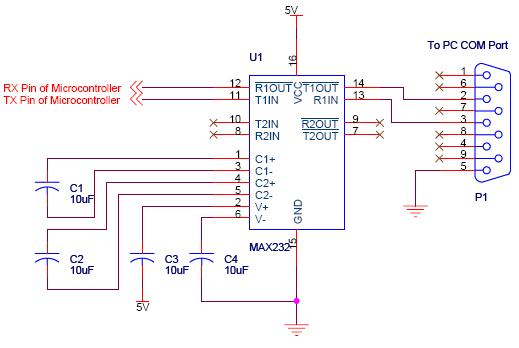
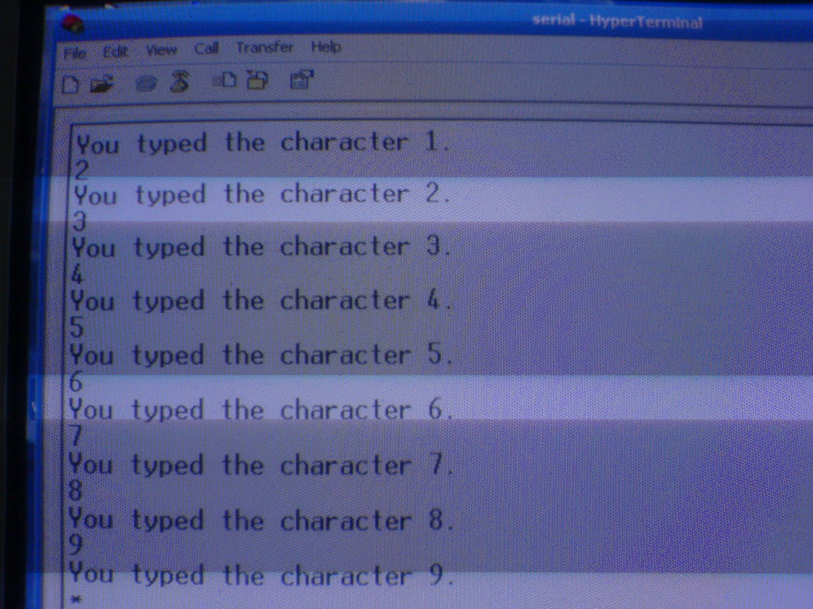
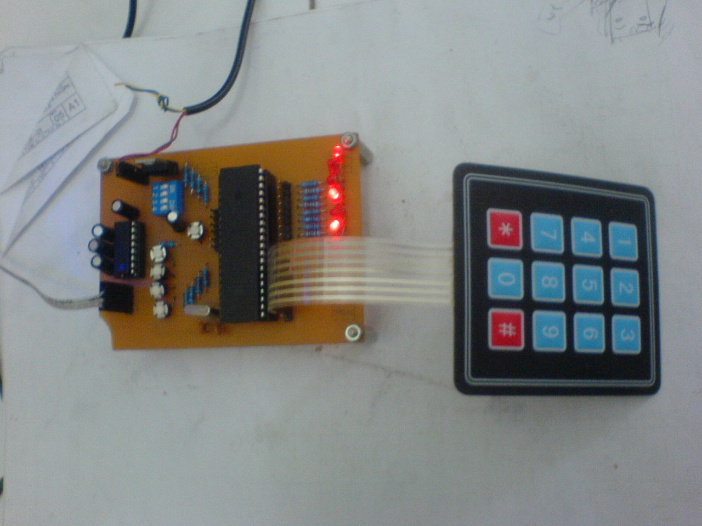

Keypad to Serial
===================

**Istantyo Triono: 13204102**

**Muhammad Zein: 13204116**

Abstrak
---------
Kelompok kami membuat rangkaian elektronik berbasis mikrokontroller 8051 yang dapat mengambil data dari keypad 3×4 dan mengirimkannya ke komputer melaui port serial berkecepatan 1200 bps. Mikrokontroller AT89S51 digunakan sebagai inti dari rangkaian. Mikrokontroller ini yang akan membaca sinyal dari keypad, menerjemahkannya serta menyiapkan data yang akan dikirmkan ke port serial. IC MAX232CPE dari Maxim sebagai jembatan penghubung antara mikrokontroller dengan port serial pada komputer. Data diterima oleh komputer dengan menggunakan software Microsoft Hyper Terminal versi 5.1.

Pendahuluan dan Latar Belakang
-------------

Salah satu bagian inti dari sebuah sistem adalah modul yang dapat menerima input dari pengguna. Alat yang digunakan untuk menerima input tersebut dapat berupa keyboard, maupun keypad. Penggunaan keypad sebagai sarana memasukkan input kedalam sistem masih banyak dipilih karena biayanya yang relative lebih murah untuk sistem yang memerlukan input karakter yang sederhana, seperti pada mesin ATM. Dengan alasan tersebut kami memilih tugas pengembangan rangkaian yang bertugas menerima data dari keypad serta mengirimkannya ke computer melalui port serial.

Desain Perangkat Keras
----------------------------
Inti dari rangkaian adalah sebuah mikrokontroller AT89S51 dengan kristal 11.059 MHz sebagai sumber clock. Tambahannya adalah sebuah keypad yang dihubungkan ke port 2 dan dibaca secara multipleksing. IC MAX232CPE digunakan sebagai penghubung dengan port serial computer. Empat buah kapasitor 10 mikrofarad dihubungkan dengan port 1, 2, 3, 4, 5, 6, 11, 12, 13, 14, 15, dan 16 dengan konfigurasi seperti pada gambar berikut : 

Untuk men-drive rangkaian 7-segment digunakan empat buah transistor PNP yang bagian Base-nya dihubungkan dengan Port 2 mikrokontroller. Gunanya sebagai penentu 7-Segment mana yang akan menyala.Tujuh buah pin pada Port 1 dihubungkan dengan keempat 7-Segment secara multiplexing untuk menentukan angka apa yang akan ditampilkan pada 7-segment. Pada Port 1 juga terpasang resistor dan led merah sebagai bagian dari minimum sistem rangkaian AT89S51.

Dua buah switch yang menentukan mode dari timer dan untuk mengganti nilai menit maupun jam dihubungkan ke port 3-6 dan 3-7. Digunakan pula dua buah LED merah kecil untuk menunjukkan mode waktu-on dan waktu-off, yaitu waktu ketika lampu menyala dan mati. Untuk mensimulasikan lampu digunakan sebuah LED merah yang berukuran lebih besar. Nantinya bagian ini akan dihubungkan ke relay yang akan menyala-matikan lampu sesuai dengan sinyal dari mikrokontroller.

Berikut adalah gambar desain perangkat keras yang digunakan sebagai simulasi dengan simulator ISIS Professional.

[enter link description here](Embeded%20%5BCLOCK%20TIMER%5D.DSN)

Desain Perangkat Lunak
---------------------------

nput untuk menentukan mode serta angka yang di-display oleh 7-Segment menggunakan sistem scanning yang digabungkan dengan de-bouncing. Display pada 7-segment dilakukan secara multiplexing karena alasan terbatasnya jumlah port yang tersedia pada mikrokontroller. Pemakaian konsep multiplexing memungkinkan port yang digunakan sesedikit mungkin.

Scanning dan multiplexing dilakukan setiap 5 milisekon dengan menggunaan fitur timer0 pada arsitektur mikrokontroller 8051. Timer0 di-set pada mode 1 dengan nilai reload EE00. 
Digunakan delay waktu yang berbeda untuk memberikan efek berkedip pada 7-Segment.
Dibawah ini mode yang digunakan beserta fungsinya :
0 : Display waktu
1 : Mengganti menit. Bagian menit berkedip.
2 : Mengganti jam. Bagian jam berkedip.
3 : Mode waktu-on. Memasukkan nilai menit-on. Bagian menit berkedip
4 : Mode waktu-on. Memasukkan nilai jam-on. Bagian jam berkedip
5 : Mode waktu-off. Memasukkan nilai menit-off. Bagian menit berkedip.
6 : Mode waktu-off. Memasukkan nilai jam-off. Bagian jam berkedip
Switch pertama digunakan untuk memilih mode sementara switch kedua untuk mengganti nilai menit atau jam (tergantung pada modenya).

Implementasi Perangkat Keras
------------------------------------

Rangkaian dasar yang digunakan adalah rangkaian minimal system untuk mikrokontroller berarsitektur 8051. Disini digunakan mikrokontroller AT89S51 keluaran Atmel. Rangkaian tambahannya adalah empat buah 7-Segment yang digunakan secara multipleks dengan menyatukan input kedelapan segmen serta common anode yang terpisah sehingga keempat 7-Segment dapat dioperasikan dengan menggunakan sebelas port saja. Common anode dihubungkan dengan Collector dari transistor PNP. Base transistor dihubungkan dengan port2 yang akan menentukan 7-Segmant mana yang akan menyala. Emitter dihubungkan dengan Vcc sebagai sumber tegangan bagi 7-Segment.

Implementasi Perangkat Lunak
-----------------------------------

Perangkat lunak dibuat dengan menggunakan bahasa C menggunakan program Keil Mikrovision3. Software ini lalu mengubah bahasa C tersebut menjadi file hex yang di-download kedalam mikrokontroller menggunakan software ISP Flash Programer 3.0a. Ini adalah source codenya : [Embeded \[CLOCK TIMER\].c](Embeded%20%5BCLOCK%20TIMER%5D.c)

Pengujian & Analisa
-----------------------

Setelah dilakukan simulasi, file-hex yang ada kemudian di-download ke dalam mikrrkontroller. Jam digital mampu menunjukkan angka yang menjadi default awal yaitu 00:00, jam 00, menit 00. Kemudian dengan menekan salah satu switch bagian jam dan menit berkedip dan dapat diganti dengan menekan switch lainnya.

Mode waktu-on dan waktu-off dapat diamati dengan melihat nyala LED merah kecil. Selain itu dengan memasukkan nilai waktu-on 00:01 dan waktu-off 00:02 fungsi penyala-matian lampu dapat dicek. Setelah satu menit dari reset, LED merah besar menyala yang menunjukkan fungsi waktu-on berhasil di-implementasikan. Satu menit kemudian LED merah besar tersebut mati yang berarti fungsi waktu-off bekerja.

Kesimpulan & Saran
-----------------------

Mikrokontroller AT89S51 dapat digunakan untuk aplikasi jam digital serta timer waktu. Aplikasi jam digital dengan memakai lebih dari satu 7-Segment mensyaratkan penggunaan metoda multiplexing guna menyalakan 7-Segment tersebut.
Debouncing input dapat diaplikasikan secara software maupun hardware dengan menggunakan kapasitor. Pada percobaan ini digunakan keduanya karena pada hardware minimum system telah tersedia fasilitas debouncing.
Tanpa transistor PNP, 7-Segment akan menyala amat redup karena arus yang keluar dari Port mikrokontroller terbagi menjadi delapan bagian, masing-masing bagian untuk menyalakan LED yang ada di 7-Segment. 
Permasalah yang cukup memusingkan dalam pembuatan alat ini adalah ketika 7-Segment terus menerus menyala tidak peduli berapapun nilai sinyal yang diberikan di Port2. Hal ini terjadi karena transistor yang digunakan adalah transistor NPN. Masalah ini selesai ketika transistor diganti menjadi transistor PNP.
